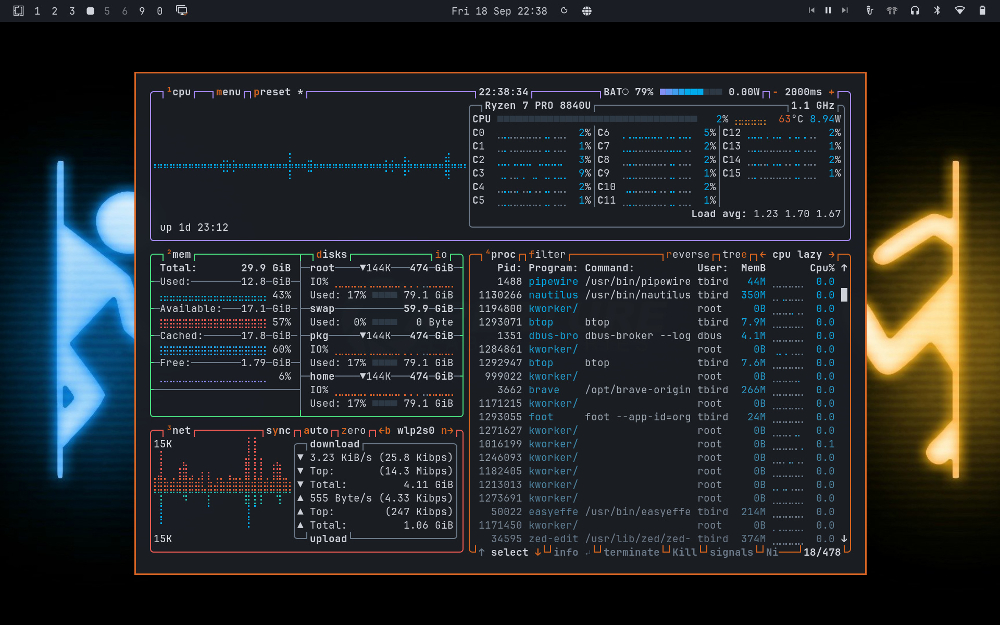

# Portal Theme for Omarchy

A dark theme for Omarchy using a blue and orange palette, inspired by the Portal video game series. Includes 15 thematic backgrounds.



## Install

Install from the terminal:

```bash
omarchy theme install https://github.com/<your-username>/portal
```

Or, open the Omarchy Menu with `Super + Space`, then choose **Install > Style > Theme** and paste:

```text
https://github.com/<your-username>/portal
```

## Included Integrations

Portal uses Omarchy's `colors.toml` to automatically generate configurations for the following systems:

| Surface | Integrations |
|---|---|
| Omarchy shell | Top bar, menus, launcher, notifications, OSD, auth prompts, image picker, lock screen |
| Hyprland | Borders, rounded corners, gaps, blur, animations, active-window glow |
| Terminals | Ghostty, Alacritty, Kitty, Foot, tmux |
| Editors | Neovim, Helix, Obsidian, VS Code, VSCodium, Cursor |
| CLI Tools | Claude Code, Pi, OpenCode, Gum, btop |
| Browsers | Chromium, Chrome, Edge, Brave, Firefox |
